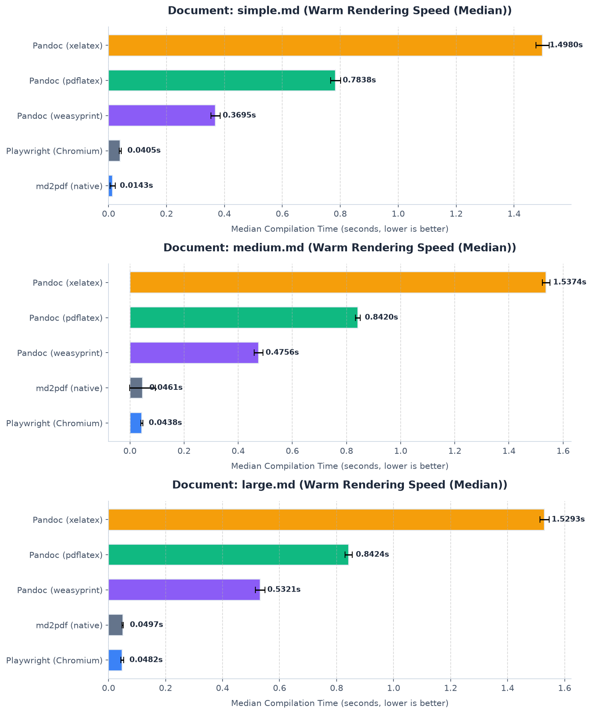
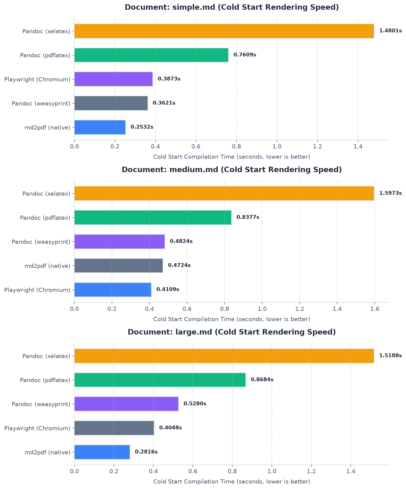
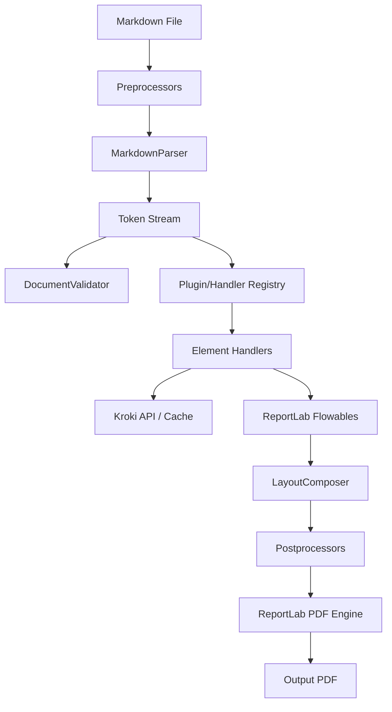

# md2pdf — Markdown to PDF in Pure Python

`md2pdf` converts your Markdown documents into beautiful, print-ready PDFs using **pure Python** — no Pandoc, Node.js, or headless Chrome needed. Powered by ReportLab and mistletoe.

[](https://pypi.org/project/pymd2pdf/)
[](https://pypi.org/project/pymd2pdf/)
[](https://github.com/Hari31416/md2pdf/blob/main/LICENSE)
[](https://github.com/Hari31416/md2pdf/actions/workflows/ci.yml)
[](https://codecov.io/gh/Hari31416/md2pdf)

---

## Why md2pdf?

Most Markdown-to-PDF tools require heavy system dependencies — and even then, getting diagrams or math to render often means installing additional packages. `md2pdf` works out of the box:

| Tool                 | Requires Pandoc | Requires Chrome | Diagrams & Math                                            | Pure Python |
| :------------------- | :-------------- | :-------------- | :--------------------------------------------------------- | :---------- |
| Pandoc-based         | ✅ Yes           | ❌ No            | ⚠️ Extra packages (e.g. mermaid-filter, LaTeX distribution) | ❌ No        |
| Puppeteer/Playwright | ❌ No            | ✅ Yes           | ⚠️ Depends on setup                                         | ❌ No        |
| **md2pdf**           | ❌ **No**        | ❌ **No**        | ✅ **Built-in (via Kroki and matplotlib)**                  | ✅ **Yes**   |

Beyond zero system dependencies, you also get:
- **Diagrams & Math** — Mermaid and LaTeX via Kroki (with SHA-256 disk caching); matplotlib used for offline LaTeX rendering when configured
- **PDF bookmarks** — every heading clickable in your PDF viewer's navigation panel
- **Multi-page tables** — split cleanly across pages with repeated headers
- **Colour emoji** — Twemoji-powered PNG emoji in your PDFs
- **Extensible plugins** — custom handlers, themes, and preprocessors

---

## Performance

Although performance was not a primary design goal, `md2pdf` is highly efficient. By parsing the Markdown AST and mapping it directly to ReportLab flowables, it naturally avoids browser launching, process forking, and intermediate HTML rendering overhead.

### Benchmarks (macOS-arm64, Apple Silicon)

To evaluate compilation speeds, we compared `md2pdf` against **Pandoc** (using various PDF engines) and **Playwright (Chromium)** across documents of different sizes:
* **Cold Start**: Spawns a clean process to capture initialization costs (like browser startup for Playwright or module import overhead for `md2pdf`).
* **Warm Start (Median)**: Measures rendering throughput by averaging subsequent runs in a warm environment.

#### Warm Start Rendering Speed (Median)


#### Cold Start Rendering Speed


#### Summary Metrics (seconds, lower is better)

| Document             | Engine                | Cold Start (s) | Warm Median (s) | Status  |
| :------------------- | :-------------------- | :------------: | :-------------: | :------ |
| **`simple.md`**      | **md2pdf (native)**   |   **0.253s**   |   **0.014s**    | Success |
| *(Short document)*   | Playwright (Chromium) |     0.387s     |     0.040s      | Success |
|                      | Pandoc (weasyprint)   |     0.362s     |     0.369s      | Success |
|                      | Pandoc (pdflatex)     |     0.760s     |     0.783s      | Success |
|                      | Pandoc (xelatex)      |     1.480s     |     1.498s      | Success |
| **`medium.md`**      | Playwright (Chromium) |     0.410s     |   **0.043s**    | Success |
| *(With math/code)*   | **md2pdf (native)**   |   **0.472s**   |   **0.046s**    | Success |
|                      | Pandoc (weasyprint)   |     0.482s     |     0.475s      | Success |
|                      | Pandoc (pdflatex)     |     0.837s     |     0.842s      | Success |
|                      | Pandoc (xelatex)      |     1.597s     |     1.537s      | Success |
| **`large.md`**       | Playwright (Chromium) |     0.404s     |   **0.048s**    | Success |
| *(Multi-page guide)* | **md2pdf (native)**   |   **0.281s**   |   **0.049s**    | Success |
|                      | Pandoc (weasyprint)   |     0.528s     |     0.532s      | Success |
|                      | Pandoc (pdflatex)     |     0.868s     |     0.842s      | Success |
|                      | Pandoc (xelatex)      |     1.518s     |     1.529s      | Success |

*Note: For `medium.md`, `md2pdf`'s cold start is higher because it contains mathematical formulas, which initializes the LaTeX math typesetting subsystem. For `large.md` (which has no math), `md2pdf`'s cold start is much faster.*

To run these benchmarks on your local system:
```bash
make benchmark
```

---

## Installation

Using `uv` (recommended):

```bash
uv tool install pymd2pdf
```

Using `pip`:

```bash
pip install pymd2pdf
```

**Heavy math documents** (physics, engineering)? Install the optional matplotlib backend for faster offline LaTeX rendering:

```bash
pip install pymd2pdf[matplotlib]
```

> **Note:** The PyPI package name is `pymd2pdf`, but the CLI command and Python import are both `md2pdf`.

---

## Quick Start

```bash
# Convert a Markdown file to PDF
md2pdf input.md -o output.pdf

# Run validation checks without producing a PDF
md2pdf input.md --validate-only

# Work offline (diagrams show source code placeholder instead)
md2pdf input.md -o output.pdf --offline
```

That's it. For most use cases, the first command is all you need.

---

## Key Features

- **Standard Elements**: Headings (H1–H6), paragraphs, lists, blockquotes, horizontal rules, and hyperlinks.
- **Multi-page Tables**: Tables split cleanly across page boundaries with repeated column headers on each page.
- **Diagrams & Math**: Mermaid diagrams and LaTeX math blocks rendered via the Kroki API, with transparent margin cropping, offline fallbacks, and SHA-256 disk caching.
- **PDF Bookmarks & Outline Panel**: Every heading (H1–H6) becomes a clickable, correctly nested entry in your PDF viewer's navigation/bookmarks panel.
- **Colour Emoji**: Twemoji-powered PNG emoji rendering in PDFs, with graceful network fallbacks.
- **Admonitions & Callouts**: GitHub-style alerts (`> [!NOTE]`, `> [!WARNING]`) and MkDocs/Obsidian fenced containers (`:::note`).
- **Broad Unicode Support**: Bundled DejaVu Sans fonts cover Latin Extended, Greek, Cyrillic, math operators, arrows, and box-drawing — no system font dependency needed.
- **Custom Fonts & Themes**: Supply your own TTF fonts and TOML-based theme overrides.
- **Extensible Plugin System**: Load custom element handlers, preprocessors, post-processors, and stylesheet/theme layers.
- **Typesetting Safeguards**: Orphaned heading prevention, ghost page elimination, and widow/orphan protection.
- **Pre-render Validation**: Catches nested tables, empty diagrams, and unsupported elements before committing to a render.

---

## CLI Options

| Flag | Shortcut | Description |
| :--- | :------- | :---------- |
| `--output` | `-o` | Output PDF path (default: `<input>.pdf`). |
| `--config` | `-c` | Path to a custom `md2pdf.toml` config file. |
| `--theme` | `-t` | Theme name to apply (default: `default`). |
| `--offline` | | Skip Kroki API calls; use source code placeholders instead. |
| `--validate-only` | | Run validation and exit without producing a PDF. |
| `--verbose` | `-v` | Output debug-level logging to `stderr`. |
| `--toc` | | Prepend a dynamically generated Table of Contents page. |
| `--header` | | Running header template (supports `{title}` and `{section}`). |
| `--header-on-first-page` | | Render the running header on the first page too. |
| `--min-image-scale` | | Minimum image scale before moving to a new page (default: `0.8`). |
| `--emoji` / `--no-emoji` | | Enable or disable Twemoji colour emoji (default: enabled). |
| `--progress` / `--no-progress` | | Show stage-level progress output on `stderr` (default: enabled). |

---

## Python API

```python
from md2pdf import convert, Config, Pipeline

# One-liner conversion
convert("input.md", "output.pdf")

# Advanced: custom config and pipeline
config = Config(
    offline=False,
    cache_dir=".md2pdf_cache",
    output_file="my_document.pdf"
)
pipeline = Pipeline(config)

# Validate before rendering
issues = pipeline.validate("# Hello World")
for issue in issues:
    print(f"[{issue.severity}] {issue.code}: {issue.message}")

# Render
pipeline.run(raw_md="# Document Title\n\nSome body text.")
```

---

## Configuration

`md2pdf` auto-discovers a `md2pdf.toml` config file in these locations (in order):

1. `./md2pdf.toml` (project-local)
2. `~/.config/md2pdf/md2pdf.toml`
3. `~/.md2pdf.toml`

You can also pass one explicitly with `--config`. See the annotated [`md2pdf.toml.example`](md2pdf.toml.example) for all available options.

---

## Documentation & Examples

| Resource                                     | Description                                        |
| :------------------------------------------- | :------------------------------------------------- |
| [User Guide](docs/user-guide.md)             | Comprehensive features reference                   |
| [Themes & Styling](docs/themes.md)           | Custom themes, fonts, and stylesheet overrides     |
| [Plugin Authoring](docs/plugin-authoring.md) | Writing custom handlers and preprocessors          |
| [User Manual (PDF)](docs/user_manual.pdf)    | Consolidated print-ready manual                    |
| [Examples](examples/)                        | Four production-grade templates with rendered PDFs |

### Example Templates

| Example                                           | Showcases                                                |
| :------------------------------------------------ | :------------------------------------------------------- |
| [`academic_paper/`](examples/academic_paper/)     | LaTeX math, citations, Mermaid flowcharts                |
| [`business_invoice/`](examples/business_invoice/) | Tables, custom Corporate Blue theme                      |
| [`project_roadmap/`](examples/project_roadmap/)   | Task lists, admonitions, Gantt charts, code highlighting |
| [`simple_cv/`](examples/simple_cv/)               | Resume layout, structural tables, clean margins          |

---

## Tech Stack

| Component                        | Library           | Description                                                       |
| :------------------------------- | :---------------- | :---------------------------------------------------------------- |
| **Core Language**                | Python >= 3.11    | Strict type-hinting throughout                                    |
| **PDF Generation**               | ReportLab >= 4.0  | Low-level document layout engine                                  |
| **Markdown Parsing**             | mistletoe >= 1.3  | Fast, extensible Markdown AST parser                              |
| **HTTP Requests**                | requests >= 2.31  | Kroki API communication                                           |
| **CLI Framework**                | typer >= 0.12     | CLI builder with validation                                       |
| **Image Processing**             | Pillow >= 10.0    | Auto-cropping and dimension detection                             |
| **LaTeX Rendering** *(optional)* | matplotlib >= 3.8 | Offline LaTeX math rendering (`pip install pymd2pdf[matplotlib]`) |

---

## Development Setup

```bash
# Clone the repository
git clone https://github.com/Hari31416/md2pdf.git
cd md2pdf

# Create virtual environment and install all dependencies (including dev)
uv sync
source .venv/bin/activate

# Install pre-commit hooks
uv run pre-commit install

# Run the test suite
uv run pytest
```

To rebuild all documentation PDFs and example renders:

```bash
make docs
```

---

## Architecture Overview

`md2pdf` runs as a four-stage pipeline: preprocessing → parsing/validation → element rendering → layout composition.



For detailed sequence-level logic, see the [User Guide](docs/user-guide.md).

---

## Project Structure

```txt
md2pdf/
├── docs/                   # Documentation suite (Markdown & consolidated PDF)
├── examples/               # Production-grade example templates with rendered PDFs
├── md2pdf/                 # Core source package
│   ├── assets/             # Kroki client, caching, and fallback elements
│   ├── core/               # Engine pipeline, parser, validator, layout, registry
│   ├── handlers/           # Element-specific flowable generators
│   ├── styles/             # Default stylesheet and theme configs
│   └── cli.py              # CLI entry point
├── scripts/                # Helper scripts (e.g. build_docs.py)
├── tests/                  # Automated test suite
├── md2pdf.toml.example     # Annotated configuration reference
└── pyproject.toml          # Build system and dependency declaration
```
