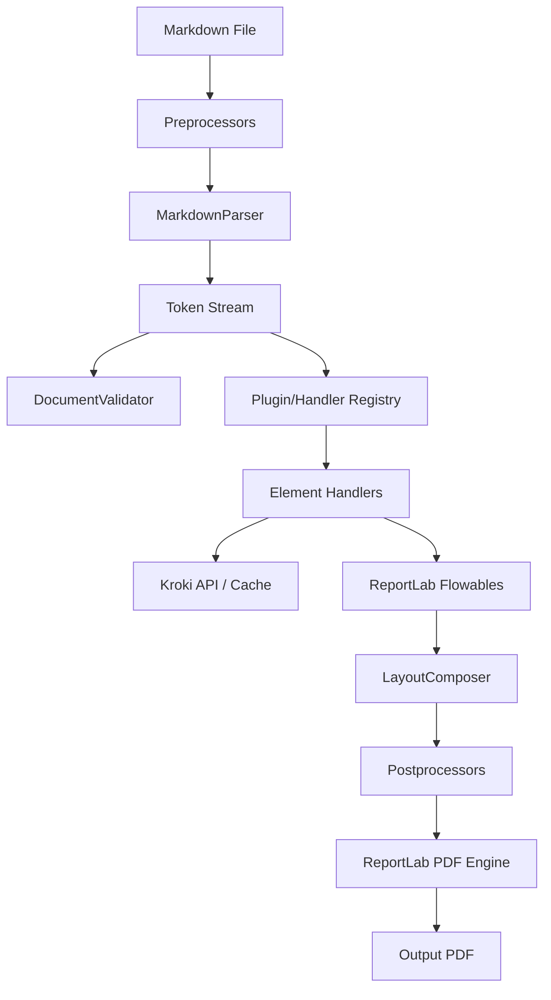
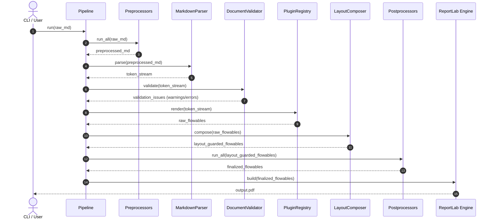

# Automated Programmatic Markdown-to-PDF Typesetting Engine

`md2pdf` converts structured Markdown documents into beautiful, print-ready PDFs. Unlike other conversion tools, it does not rely on heavy system dependencies like Pandoc, Node.js, or headless Chrome/Chromium browsers. It is written in pure Python and powered by ReportLab and mistletoe.

---

## Architecture Overview

`md2pdf` is designed as a pipeline that runs in four distinct stages: preprocessing, parsing/validation, element rendering, and layout composition. 



---

## Key Features

- **Standard Elements**: Headings (H1–H6), paragraphs, lists, blockquotes, horizontal rules, and hyperlinks.
- **Multi-page Tables**: Tables split cleanly across page boundaries. Headers repeat at the top of every page.
- **Diagrams & Math Blocks**: Renders Mermaid diagrams and LaTeX math blocks via the Kroki API, with automatic transparent/white margin cropping, offline fallbacks, and SHA-256 disk caching.
- **Extensible Plugin System**: Load custom element handlers, text-level preprocessors, post-processors, and stylesheet/theme layers.
- **Typesetting Safeguards**: Implements strict "anti-fail" layout rules including orphaned heading protection, ghost page elimination, and widow/orphan line settings.
- **DX-First Validation**: Pre-render validation runs to identify nested tables, empty diagrams, or unsupported elements before rendering.

---

## Tech Stack

| Component            | Library/Tool     | Description                                        |
| :------------------- | :--------------- | :------------------------------------------------- |
| **Core Language**    | Python >= 3.11   | Modern Python with strict type-hinting             |
| **PDF Generation**   | ReportLab >= 4.0 | Low-level document layout and flowable engine      |
| **Markdown Parsing** | mistletoe >= 1.3 | Fast and extensible Markdown AST parser            |
| **HTTP Requests**    | requests >= 2.31 | Handles communication with Kroki API               |
| **CLI Framework**    | typer >= 0.12    | CLI builder for options and validation errors      |
| **Image Processing** | pillow >= 10.0   | Auto-cropping and dimension detection for diagrams |

---

## Project Structure

```txt
md2pdf/
├── docs/                   # Developer documentation
│   ├── plugin-authoring.md # Instructions for writing plugins
│   └── themes.md           # Themes and stylesheet reference
├── md2pdf/                 # Core source directory
│   ├── assets/             # Kroki client, caching, and fallback elements
│   ├── core/               # Engine pipeline, parser, validator, layout, registry
│   ├── handlers/           # Element-specific flowable generators (headings, tables, etc.)
│   ├── styles/             # Default stylesheet and theme configs
│   ├── cli.py              # CLI entry point
│   └── pipeline.py         # Main execution coordinator
├── tests/                  # Automated test suite
│   ├── fixtures/           # Markdown and configuration test files
│   ├── test_cli.py         # CLI integration tests
│   └── test_pipeline.py    # Pipeline validation tests
├── pyproject.toml          # Build system and dependency declaration
└── README.md               # Project overview
```

---

## Logic Flows

The diagram below details the sequence of execution inside the `Pipeline` class:



---

## Installation & Setup

Using `uv` (recommended):
```bash
uv tool install pymd2pdf
```

Or via standard `pip`:
```bash
pip install pymd2pdf
```

To initialize the project for local development:
```bash
# Clone the repository
git clone https://github.com/user/md2pdf.git
cd md2pdf

# Create virtual environment and install dependencies
uv venv
source .venv/bin/activate
uv pip install -e ".[dev]"
```

---

## Usage Examples

### Command Line Interface

Convert a Markdown file:
```bash
md2pdf input.md -o output.pdf
```

Execute pre-render validation checks without producing a PDF:
```bash
md2pdf input.md --validate-only
```

Run in offline mode to avoid calling the Kroki API (places image boxes with source code in the PDF instead):
```bash
md2pdf input.md -o output.pdf --offline
```

### CLI Options

| Flag | Shortcut | Description |
| :--- | :--- | :--- |
| `--output` | `-o` | Path to save the output PDF file (default: `output.pdf`). |
| `--config` | `-c` | Path to a custom `md2pdf.toml` config file. |
| `--theme` | `-t` | Name of the theme to apply (default: `default`). |
| `--offline` | | Skip external API requests (e.g. Kroki diagram rendering) and use local placeholders. |
| `--validate-only`| | Execute pre-render validation checks and exit without building a PDF. |
| `--verbose` | `-v` | Output debug-level logging to `stderr`. |

### Programmatic Python Usage

```python
from md2pdf import convert, Config, Pipeline

# Option 1: Simple conversion
convert("input.md", "output.pdf")

# Option 2: Advanced programmatic pipeline usage
config = Config(
    offline=False, 
    cache_dir=".md2pdf_cache", 
    output_file="my_document.pdf"
)
pipeline = Pipeline(config)

# Validate markdown document
issues = pipeline.validate("# Hello World")
for issue in issues:
    print(f"[{issue.severity}] {issue.code}: {issue.message}")

# Render markdown
pipeline.run(raw_md="# Document Title\n\nSome body text.")
```
