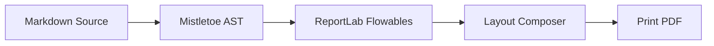

# md2pdf Feature Showcase & Rendering Test

This document serves as both a user guide and a comprehensive rendering test suite for the `md2pdf` typesetting engine. It includes all supported Markdown and layout elements to verify visual layout quality, vertical spacing, and formatting.

---

## 1. Quick Start Guide

`md2pdf` is a pure-Python Markdown-to-PDF compiler that translates standard Markdown and extended features (like LaTeX equations and Mermaid diagrams) directly into print-ready PDF files using ReportLab.

### Command Line Interface

Convert this document to a PDF:
```bash
md2pdf docs/showcase.md -o docs/showcase.pdf
```

Enable validation checks without writing a PDF:
```bash
md2pdf docs/showcase.md --validate-only
```

Run in offline mode to use placeholders for network-dependent elements (e.g. diagrams):
```bash
md2pdf docs/showcase.md -o docs/showcase.pdf --offline
```

### Programmatic Python API

```python
from md2pdf import convert, Config, Pipeline

# Direct conversion
convert("docs/showcase.md", "docs/showcase.pdf")

# Custom pipeline settings
config = Config(
    input_file="docs/showcase.md",
    output_file="docs/showcase.pdf",
    offline=False,
    min_image_scale=0.75
)
pipeline = Pipeline(config)
pipeline.run(raw_md="# My Doc\nSome text.")
```

---

## 2. Heading Typography Hierarchy

Below is the vertical stack of headings from H1 through H6. Heading levels 5 and 6 fall back to the H4 style for clean presentation since standard PDF engines support up to 4 heading levels out-of-the-box.

# Heading Level 1 (H1)
## Heading Level 2 (H2)
### Heading Level 3 (H3)
#### Heading Level 4 (H4)
##### Heading Level 5 (H5 - fallback to H4 style)
###### Heading Level 6 (H6 - fallback to H4 style)

---

## 3. Inline Elements and Styles

This section tests inline layout and inline style parsing:
- **Strong/Bold**: This is a **strongly emphasized text block** using double asterisks.
- *Emphasis/Italic*: This is an *emphasized text block* using single asterisks.
- **Nested Styles**: You can combine styles like ***bold-italic nested runs***.
- `Code Inline`: Use backticks for monospace symbols like `Pipeline`, `ThemeConfig`, or `build_default_stylesheet()`.
- Hyperlinks: Clickable links like the [md2pdf GitHub page](https://github.com/user/md2pdf) are automatically colored.

---

## 4. Lists

`md2pdf` supports ordered, unordered, and multi-level nested lists.

### Unordered Bullet List
- Top-level item A
- Top-level item B
  - Nested sub-item B.1
  - Nested sub-item B.2
    - Deeply nested sub-item B.2.a
- Top-level item C

### Ordered Numbered List
1. First step in the instructions
2. Second step in the instructions
   1. Sub-step 2.a
   2. Sub-step 2.b
3. Final step

---

## 5. Blockquotes

Blockquotes are styled with a left vertical accent bar and an indented block format.

> "Simplicity is the ultimate sophistication."
> — Leonardo da Vinci

> This is a multi-paragraph blockquote. It maintains indentation and the vertical border across all blocks.
>
> Here is the second paragraph inside the same blockquote.

---

## 6. Code Blocks (Syntax Highlighting)

Monospaced code blocks are typeset with syntax highlighting powered by Pygments (theme customizable via the stylesheet configuration).

```python
import os
from reportlab.platypus import Paragraph

def hello_world(name: str) -> None:
    # A simple hello world script to verify syntax colors
    message = f"Hello, {name}!"
    print(message)
```

---

## 7. Tables

Tables split cleanly across page boundaries. Table columns automatically distribute width evenly across the printable area, and the header repeats at the top of every page.

| Parameter      | Type  | Default            | Description                   |
| :------------- | :---- | :----------------- | :---------------------------- |
| `font_body`    | `str` | `"Helvetica"`      | Body typeface.                |
| `font_heading` | `str` | `"Helvetica-Bold"` | Heading typeface.             |
| `spacing_base` | `int` | `8`                | Base vertical spacing metric. |
| `color_link`   | `str` | `"#0366d6"`        | Hex color string for links.   |

---

## 8. Diagrams (Mermaid)

Mermaid diagram blocks are rendered as cropped PNG images using the Kroki API and cached locally.



---

## 9. Math & Equations (LaTeX)

LaTeX math expressions are compiled to transparent images and centered:

$$
f(x) = \int_{-\infty}^{\infty} \hat{f}(\xi) e^{2 \pi i x \xi} d\xi
$$

---

## 10. Images & Placeholders

Standard images are scaled down automatically to fit within the printable page area.

### Missing Image Placeholder
If an image file is missing or corrupt, a placeholder box is rendered instead of throwing a compiler crash error:


---

## 11. File Inclusion (!include)

You can split documents into multiple reusable files and combine them at compile-time:

!include included_feature.md
