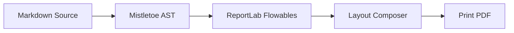
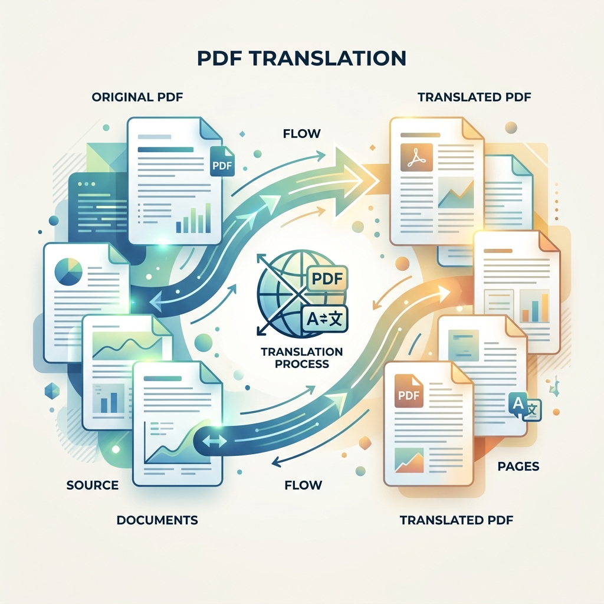

# md2pdf Feature Showcase & Rendering Test

This document serves as both a user guide and a comprehensive rendering test suite for the `md2pdf` typesetting engine. It includes all supported Markdown and layout elements to verify visual layout quality, vertical spacing, and formatting.

---

## 1. Quick Start Guide

`md2pdf` is a pure-Python Markdown-to-PDF compiler that translates standard Markdown and extended features (like LaTeX equations and Mermaid diagrams) directly into print-ready PDF files using ReportLab.

### Command Line Interface

Convert this document to a PDF:

```bash
md2pdf docs/showcase.md -o docs/showcase.pdf
```

Watch for changes and automatically re-render the PDF:

```bash
md2pdf docs/showcase.md -o docs/showcase.pdf --watch
```

Enable validation checks without writing a PDF:

```bash
md2pdf docs/showcase.md --validate-only
```

Run validation and output results in JSON format:

```bash
md2pdf docs/showcase.md --validate-only --format json
```

Run in offline mode to use placeholders for network-dependent elements (e.g. diagrams):

```bash
md2pdf docs/showcase.md -o docs/showcase.pdf --offline
```

Compile a deterministic PDF (byte-identical builds for CI caching/reproducibility):

```bash
md2pdf docs/showcase.md -o docs/showcase.pdf --deterministic
```

### Programmatic Python API

```python
from md2pdf import convert, Config, Pipeline

# Direct conversion
convert("docs/showcase.md", "docs/showcase.pdf")

# Custom pipeline settings
config = Config(
    input_file="docs/showcase.md",
    output_file="docs/showcase.pdf",
    offline=False,
    min_image_scale=0.75
)
pipeline = Pipeline(config)
pipeline.run(raw_md="# My Doc\nSome text.")
```

---

## 2. Heading Typography Hierarchy

Below is the vertical stack of headings from H1 through H6. Heading levels 5 and 6 fall back to the H4 style for clean presentation since standard PDF engines support up to 4 heading levels out-of-the-box.

# Heading Level 1 (H1)

## Heading Level 2 (H2)

### Heading Level 3 (H3)

#### Heading Level 4 (H4)

##### Heading Level 5 (H5 - fallback to H4 style)

###### Heading Level 6 (H6 - fallback to H4 style)

---

## 3. Inline Elements and Styles

This section tests inline layout and inline style parsing:

- **Strong/Bold**: This is a **strongly emphasized text block** using double asterisks.
- _Emphasis/Italic_: This is an _emphasized text block_ using single asterisks.
- **Nested Styles**: You can combine styles like **_bold-italic nested runs_**.
- `Code Inline`: Use backticks for monospace symbols like `Pipeline`, `ThemeConfig`, or `build_default_stylesheet()`.
- Hyperlinks: Clickable links like the [md2pdf GitHub page](https://github.com/hari31416/md2pdf) are automatically colored.
- **Strikethrough**: This is a ~~strikethrough text run~~ showing a horizontal line through text.
- ==Highlight==: This is a ==highlighted text run== showcasing text with a yellow background.
- **Superscript**: This is a superscript text run: x^2^ + y^2^ = r^2^.
- **Subscript**: This is a subscript text run: H~2~O, CO~2~.
- **Footnotes**: Clickable footnote references[^1] linked to their definitions[^2] at the bottom of the page.

[^1]: This is the first footnote definition, explaining reference 1.

[^2]: This is the second footnote definition, containing inline formatting like **bold text** and ~~strikethrough~~.

---

## 4. Lists

`md2pdf` supports ordered, unordered, and multi-level nested lists.

### Unordered Bullet List

- Top-level item A
- Top-level item B
  - Nested sub-item B.1
  - Nested sub-item B.2
    - Deeply nested sub-item B.2.a
- Top-level item C

### Ordered Numbered List

1. First step in the instructions
2. Second step in the instructions
   1. Sub-step 2.a
   2. Sub-step 2.b
3. Final step

### Task List Checkboxes

- [ ] Uncompleted task list item
- [x] Completed task list item (lowercase)
- [x] Completed task list item (uppercase)
- [ ] Task list item with a link: [md2pdf GitHub page](https://github.com/hari31416/md2pdf)
- [ ] Task list item with inline code: `x = 1`

---

## 5. Blockquotes

Blockquotes are styled with a left vertical accent bar and an indented block format.

> "Simplicity is the ultimate sophistication."
> — Leonardo da Vinci

> This is a multi-paragraph blockquote. It maintains indentation and the vertical border across all blocks.
>
> Here is the second paragraph inside the same blockquote.

---

## 6. Admonition & Callout Blocks

`md2pdf` supports Obsidian/MkDocs style fenced admonitions (`:::type`, etc.) and GitHub Markdown alerts (`> [!TYPE]`, etc.) with customizable titles and distinct border/background styling.

### Fenced Admonitions

#### Blue / Slate Themes (`note`, `info`, `todo`)

:::note
This is a standard `note` callout block.
:::

:::info "Information"
This is an `info` callout block with a custom title.
:::

:::todo "Task Checklist"
This is a `todo` callout block for keeping track of tasks.
:::

#### Green Themes (`tip`, `success`, `check`)

:::tip "Pro Tip"
This is a `tip` callout block to share helpful suggestions.
:::

:::success "Completed successfully"
This is a `success` callout block indicating successful completion.
:::

:::check "Status Checked"
This is a `check` callout block verifying a positive status.
:::

#### Amber / Orange Themes (`warning`, `attention`)

:::warning "Potential Risk"
This is a `warning` callout block indicating a warning condition.
:::

:::attention "Attention Required"
This is an `attention` callout block for items needing care.
:::

#### Red Themes (`danger`, `error`, `failure`, `bug`, `caution`)

:::danger "Critical Danger"
This is a `danger` callout block for serious threats or data loss alerts.
:::

:::error "Error Encountered"
This is an `error` callout block showing critical execution issues.
:::

:::failure "Build Failed"
This is a `failure` callout block indicating a failed pipeline run.
:::

:::bug "Active Bug"
This is a `bug` callout block to highlight software defects.
:::

:::caution "Precautionary Note"
This is a `caution` callout block with red theme styling.
:::

#### Teal / Cyan Theme (`important`)

:::important "Crucial Note"
This is an `important` callout block highlighting key details.
:::

#### Unknown Fallback Theme

:::custom "Custom Type"
This is a fallback custom type admonition showing the default theme color.
:::

### GitHub-style Markdown Alerts

> [!NOTE]
> This is a GitHub-style `NOTE` alert block.

> [!TIP]
> This is a GitHub-style `TIP` alert block.

> [!IMPORTANT]
> This is a GitHub-style `IMPORTANT` alert block.

> [!WARNING]
> This is a GitHub-style `WARNING` alert block.

> [!CAUTION]
> This is a GitHub-style `CAUTION` alert block.

---

## 7. Code Blocks (Syntax Highlighting)

Monospaced code blocks are typeset with syntax highlighting powered by Pygments (theme customizable via the stylesheet configuration).

```python
import os
from reportlab.platypus import Paragraph

def hello_world(name: str) -> None:
    # A simple hello world script to verify syntax colors
    message = f"Hello, {name}!"
    print(message)
```

---

## 8. Tables

Tables split cleanly across page boundaries. Table columns automatically distribute width evenly across the printable area, and the header repeats at the top of every page.

| Parameter      | Type  | Default             | Description                   |
| :------------- | :---- | :------------------ | :---------------------------- |
| `font_body`    | `str` | `"DejaVuSans"`      | Body typeface.                |
| `font_heading` | `str` | `"DejaVuSans-Bold"` | Heading typeface.             |
| `spacing_base` | `int` | `8`                 | Base vertical spacing metric. |
| `color_link`   | `str` | `"#0366d6"`         | Hex color string for links.   |

### Table Alignment Showcase

Below is a table demonstrating left, center, right, and default column alignments:

| Left Aligned   |  Center Aligned  |   Right Aligned | Default Aligned   |
| :------------- | :--------------: | --------------: | ----------------- |
| Text Left      |   Text Center    |      Text Right | Text Default      |
| Left text long | Center text long | Right text long | Default text long |

---

## 9. Diagrams (Mermaid)

Mermaid diagram blocks are rendered as cropped PNG images using the Kroki API and cached locally.



---

## 10. Math & Equations (LaTeX)

LaTeX math expressions are compiled to transparent images and centered:

$$
f(x) = \int_{-\infty}^{\infty} \hat{f}(\xi) e^{2 \pi i x \xi} d\xi
$$

---

## 11. Images & Placeholders

Standard images are scaled down automatically to fit within the printable page area.

### Missing Image Placeholder

If an image file is missing or corrupt, a placeholder box is rendered instead of throwing a compiler crash error:


### Working Image Example

Successful image references are dynamically loaded, scaled, and centered:



---

## 12. Unicode & Special Characters

`md2pdf` uses **DejaVu Sans** as its default font family, bundled directly with the package. DejaVu provides broad Unicode coverage so that special characters render correctly out-of-the-box — no configuration required.

### Latin Extended

Accented characters and diacritics appear natively without escaping:

café, naïve, résumé, Ångström, Zürich, façade, Ñoño, fiançailles, jalapeño, Łódź

### Greek Alphabet

Full Greek alphabet support for scientific and mathematical documents:

α β γ δ ε ζ η θ ι κ λ μ ν ξ ο π ρ σ τ υ φ χ ψ ω

Α Β Γ Δ Ε Ζ Η Θ Ι Κ Λ Μ Ν Ξ Ο Π Ρ Σ Τ Υ Φ Χ Ψ Ω

### Cyrillic

Russian and other Cyrillic scripts are fully supported:

Привет мир — Москва, Санкт-Петербург, Екатеринбург

Україна, Беларусь, Србија, България

### Mathematical Operators & Symbols

Common math notation renders without needing LaTeX blocks:

∑ ∏ ∫ ∂ √ ∛ ∞ ∅ ∈ ∉ ∩ ∪ ⊂ ⊃ ⊆ ⊇

≤ ≥ ≠ ≈ ≡ ≪ ≫ ± × ÷ · ∓ ∝ ∼

### Arrows

← → ↑ ↓ ↔ ↕ ↖ ↗ ↘ ↙

⇐ ⇒ ⇑ ⇓ ⇔ ⇕ ⟵ ⟶ ⟷

### Box Drawing

Useful for ASCII-art tables and tree structures embedded in plain text:

```
┌─────────────┬─────────────┐
│  Cell A     │  Cell B     │
├─────────────┼─────────────┤
│  Cell C     │  Cell D     │
└─────────────┴─────────────┘
```

### Currency Symbols

$ € £ ¥ ₹ ₽ ₩ ₺ ₿ ¢ ₣ ₦ ₴ ₪

### Typographic Punctuation

Em dash —, en dash –, ellipsis …, curly quotes " " ' ', guillemets « »,
bullet •, section §, pilcrow ¶, dagger †, double dagger ‡,
trademark ™, copyright ©, registered ®, degree °

### Superscript & Subscript Lookalikes

H₂O, CO₂, E = mc², x² + y² = r², Aₙ → Bₙ

### Custom Font via `md2pdf.toml`

To use a different font, add the following to your `md2pdf.toml`. The engine
registers the TTF file automatically — no plugin or Python code required:

```toml
[theme]
font_body      = "NotoSans"
font_file_body = "/path/to/NotoSans-Regular.ttf"

font_heading      = "NotoSans-Bold"
font_file_heading = "/path/to/NotoSans-Bold.ttf"

font_mono      = "NotoSansMono"
font_file_mono = "/path/to/NotoSansMono-Regular.ttf"
```

Tilde expansion (`~/fonts/MyFont.ttf`) is supported.

### Colour Emoji (Twemoji) 😎

Emoji codepoints are automatically detected and replaced with full-colour **Twemoji** PNG images,
cached locally on first use. No configuration required — it works out of the box.

Single emoji: 🌍 🚀 🎉 ✅ ❌ 🔥 💡 🧠 🐍 📄

Emoji in prose: The build passed 🎉 and all tests are green ✅. Deploy to production 🚀?

Faces and people: 😀 😎 🤔 😅 🙌 👏 🫶 👍 🤝 🧑‍💻

Nature and travel: 🌸 🌊 🏔️ 🌅 🌙 ⭐ 🌈 🦋 🌿 🍀

Food and objects: 🍕 ☕ 🎸 📦 🔑 📌 🗂️ 📊 🔬 🛠️

Emoji mixed with code references: Use `convert()` 🔧 and `Pipeline` 🚰 together.

To disable emoji substitution, pass `--no-emoji` on the CLI or set `emoji = false` in `md2pdf.toml`:

```bash
md2pdf docs/showcase.md --no-emoji
```

```toml
[md2pdf]
emoji = false
```

## 13. Colour Emoji Showcase

This section verifies end-to-end rendering of emoji characters across multiple contexts.

### Inline Paragraph Emoji

All systems nominal 🟢 — pipeline complete 🏁. Found **3 warnings** ⚠️ and **0 errors** ✅.

### Emoji in Headings and Lists

#### 🗒️ Today's Task List

- 🔍 Run the full test suite
- 📝 Update the changelog
- 🚀 Tag and publish the release
- 🎉 Celebrate!

#### 📊 Status Summary

| Component        | Status |
| :--------------- | :----- |
| Core pipeline    | ✅ OK  |
| Emoji support    | ✅ OK  |
| LaTeX rendering  | ✅ OK  |
| Mermaid diagrams | ✅ OK  |

### ZWJ Sequences

Complex multi-codepoint emoji sequences (joined with a Zero-Width Joiner) are handled as a
single unit so they map to the correct Twemoji image:

🧑‍💻 (person: technologist) · 👨‍👩‍👧‍👦 (family) · 🏳️‍🌈 (rainbow flag)

### Emoji in Blockquotes

> 🔑 **Key insight:** Colour emoji in PDFs previously required replacing the entire ReportLab rendering backend. The Twemoji approach slots in as a lightweight pre-processor with zero pipeline changes — emoji PNGs are cached after the first download 📥.

---

## 14. File Inclusion (!include)

You can split documents into multiple reusable files and combine them at compile-time:

!include included_feature.md

## 15. Page Breaks

You can manually control pagination using either the standard HTML comment directive or a custom backslash directive. This compiles directly into a PDF PageBreak flowable.

<!-- pagebreak -->

### HTML Comment Syntax

```markdown
<!-- pagebreak -->
```

### Backslash Syntax

```markdown
\pagebreak
```

Both directives must reside on their own line (leading/trailing whitespace is allowed, and they are case-insensitive).

---

## 16. Cover Page Generation

You can automatically prepend a beautifully formatted cover/title page before the Table of Contents by passing the `--cover` CLI flag:

```bash
md2pdf docs/showcase.md -o docs/showcase.pdf --cover
```

The cover page is generated dynamically using keys declared in the document's YAML front-matter metadata:

- `title`: Extracted and displayed in a large, bold format. Defaults to the source filename if not explicitly provided.
- `author`: Rendered only if explicitly declared in the front-matter metadata (omitting the default library branding).
- `date`: Rendered only if explicitly declared in the front-matter metadata.

When a cover page is generated, page-level running headers, header rules, and footers (page numbers) are automatically suppressed on the first page.

## 17. Page-Size & Orientation Configuration

You can customize the PDF page size and orientation:

```bash
md2pdf docs/showcase.md -o docs/showcase.pdf --page-size A3 --orientation landscape
```

This compiles the document using the A3 landscape format. Supported page sizes include any standard size in ReportLab (e.g. `A4`, `Letter`, `A3`, `Legal`). Orientation can be `portrait` or `landscape`.
