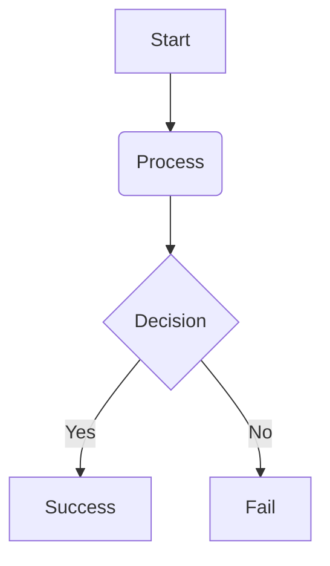

# md2pdf User Guide & Feature Reference

This guide provides a comprehensive reference to all features, configuration settings, syntax extensions, and layout rules in the `md2pdf` Markdown-to-PDF typesetting engine.

---

## Table of Contents
- [md2pdf User Guide \& Feature Reference](#md2pdf-user-guide--feature-reference)
  - [Table of Contents](#table-of-contents)
  - [Installation \& Setup](#installation--setup)
  - [CLI Flag Reference](#cli-flag-reference)
  - [Configuration File (md2pdf.toml)](#configuration-file-md2pdftoml)
    - [Configuration Schema Reference](#configuration-schema-reference)
  - [YAML Front Matter \& PDF Metadata](#yaml-front-matter--pdf-metadata)
    - [Example Markdown:](#example-markdown)
  - [Table of Contents (TOC)](#table-of-contents-toc)
  - [Running Headers \& Footers](#running-headers--footers)
    - [Page Footers](#page-footers)
    - [Page Headers](#page-headers)
  - [Colour Emoji Support (Twemoji)](#colour-emoji-support-twemoji)
  - [Task Lists \& Checkboxes](#task-lists--checkboxes)
  - [Footnotes](#footnotes)
    - [Syntax:](#syntax)
    - [Layout Logic:](#layout-logic)
  - [Strikethrough \& Highlight](#strikethrough--highlight)
  - [File Inclusion (!include)](#file-inclusion-include)
    - [Key Behaviors:](#key-behaviors)
  - [Admonitions \& GitHub Alerts](#admonitions--github-alerts)
    - [1. Fenced Container Admonitions (Obsidian/MkDocs style)](#1-fenced-container-admonitions-obsidianmkdocs-style)
    - [2. Markdown Blockquote Alerts (GitHub-style)](#2-markdown-blockquote-alerts-github-style)
    - [Supported Styles and Severity Levels](#supported-styles-and-severity-levels)
  - [Explicit Page Breaks](#explicit-page-breaks)
    - [HTML Comment Syntax](#html-comment-syntax)
    - [Backslash Syntax](#backslash-syntax)
  - [Progress Reporting](#progress-reporting)
    - [Stages reported:](#stages-reported)
    - [Disabling Progress Reporting:](#disabling-progress-reporting)
  - [Tables \& Layout Safeguards](#tables--layout-safeguards)
    - [Repeating Headers \& Row Protection](#repeating-headers--row-protection)
    - [Heading-to-Table Bonding (`KeepTogetherParts`)](#heading-to-table-bonding-keeptogetherparts)
  - [HTML Line Breaks ()](#html-line-breaks-)
  - [Diagrams (Mermaid) \& Math (LaTeX)](#diagrams-mermaid--math-latex)
    - [Mermaid Syntax](#mermaid-syntax)
    - [LaTeX Math Syntax](#latex-math-syntax)
    - [Caching and Layout Protection:](#caching-and-layout-protection)
  - [Unicode \& Fonts](#unicode--fonts)

---

## Installation & Setup

Install the library using `uv` (recommended) or `pip`:

```bash
# Using uv
uv tool install pymd2pdf

# Using pip
pip install pymd2pdf
```

To run the CLI:
```bash
md2pdf input.md -o output.pdf
```

---

## CLI Flag Reference

The CLI is built with `typer` and supports the following options:

| Flag                     | Shortcut     | Description                                                                 |
| :----------------------- | :----------- | :-------------------------------------------------------------------------- |
| `input`                  | *(Argument)* | Path to the source `.md` file to be compiled.                               |
| `--output`               | `-o`         | Output PDF file path. Defaults to `<input-filename>.pdf`.                   |
| `--config`               | `-c`         | Path to a custom `md2pdf.toml` config file.                                 |
| `--theme`                | `-t`         | Theme name to apply (defaults to `"default"`).                              |
| `--offline`              |              | Skip external API requests (e.g. Kroki). Uses local placeholders instead.   |
| `--verbose`              | `-v`         | Enable verbose debug-level logging to `stderr`.                             |
| `--validate-only`        |              | Runs DX-first pre-render validation checks and exits.                       |
| `--min-image-scale`      |              | Minimum image scale factor (e.g. `0.8`) before moving images to a new page. |
| `--toc`                  |              | Prepend a dynamically generated Table of Contents page.                     |
| `--header`               |              | Header text/template. Supports `{title}` and `{section}` placeholders.      |
| `--header-on-first-page` |              | Render the running header on the first page.                                |
| `--emoji` / `--no-emoji` |              | Enable or disable colour Twemoji image substitution.                        |
| `--progress` / `--no-progress` |        | Show or hide stage-level compilation progress on stderr (default: enabled). |

---

## Configuration File (md2pdf.toml)

When running the conversion, the CLI automatically looks for configuration files in the following order of precedence:
1. File explicitly passed via `--config / -c`.
2. `md2pdf.toml` in the current working directory.
3. `~/.config/md2pdf/md2pdf.toml` in your home directory.
4. `~/.md2pdf.toml` in your home directory.

All settings in the file are optional. If omitted, built-in defaults are used.

### Configuration Schema Reference

```toml
[md2pdf]
output_file          = "output.pdf"
theme                = "default"
offline              = false                 # true = skip Kroki API calls, render placeholders instead
cache_dir            = "~/.cache/pymd2pdf"
min_image_scale      = 0.8                   # minimum image scale factor before deferring to a new page
toc                  = false                 # true = generate a Table of Contents page
header               = "{title} | {section}" # Running header template (supports {title} and {section} placeholders)
header_on_first_page = false                 # true = render running header on the first page
emoji                = true                  # true = translate emoji codepoints into Twemoji images

[theme]
# Typography
font_body    = "DejaVuSans"
font_heading = "DejaVuSans-Bold"
font_mono    = "DejaVuSansMono"

# Custom TTF fonts
# To use your own font, set BOTH the logical name AND the path to the .ttf file.
# font_file_body    = "/path/to/font.ttf"
# font_file_heading = "/path/to/font-bold.ttf"
# font_file_mono    = "/path/to/font-mono.ttf"

# Colors (Hexadecimal)
color_body_text       = "#000000"
color_blockquote_text = "#555555"
color_link            = "#0366d6"
color_hr              = "#cccccc"

# Tables
color_table_header_bg   = "#2c3e50"
color_table_header_text = "#ffffff"
color_table_grid        = "#cccccc"
color_table_row_odd     = "#ffffff"
color_table_row_even    = "#f5f5f5"

# Blockquotes & Code Blocks
color_blockquote_bar = "#cccccc"
color_code_bg        = "#f5f5f5"
syntax_style         = "default"             # Pygments style name for code blocks
```

---

## YAML Front Matter & PDF Metadata

If your Markdown document starts with a YAML front-matter block, `md2pdf` automatically parses it and applies the values to the final PDF file metadata.

### Example Markdown:
```markdown
---
title: "Quarterly Financial Analysis"
author: "Acme Corp Analytics"
subject: "Q2 Progress and Metrics Report"
keywords: "finance, analytics, report, quarterly"
---

# Q2 Progress Report
...
```

If these fields are missing, the engine falls back to:
* **Title**: The base name of the input file (e.g. `README`).
* **Author**: `"pymd2pdf"`.

---

## Table of Contents (TOC)

When Table of Contents generation is enabled (using CLI `--toc` or setting `toc = true` in `md2pdf.toml`), `md2pdf` automatically inserts a Table of Contents page immediately after the first page of your document.

* The TOC generator scans the document for heading bookmarks (H1 to H6).
* Standard layout formatting ensures headings are indented by depth level.
* Clickable, colored hyperlink lines map the heading titles directly to their pages.
* Page numbers are computed dynamically using a two-pass rendering cycle.

---

## Running Headers & Footers

### Page Footers
Every page of the compiled PDF displays a centered footer showing the page number in the format `— Page X —`.

### Page Headers
Running headers are configurable and disabled by default. When enabled (via CLI `--header` or config `header`), they print at the top left of the page margins, separated by a thin rule.

* **Placeholder Substitution**:
  * `{title}` is substituted with the document title parsed from the YAML front matter or fallback file name.
  * `{section}` is substituted with the most recent H1 or H2 heading currently appearing on or before that page.
* **Control Page 1**: The CLI flag `--header-on-first-page` or config `header_on_first_page = true` toggles whether headers render on the first page.

---

## Colour Emoji Support (Twemoji)

`md2pdf` supports colour emojis inline in prose, list items, headings, and blockquotes. Because standard PDF reader engines and the ReportLab layout engine do not support colour tables in TTF fonts, the engine runs an emoji processor:

1. A preprocessor scans the Markdown source for unicode emoji characters.
2. Emojis are replaced with an inline HTML `` tag pointing to high-quality Twemoji PNG graphics.
3. On the first run, the images are downloaded via HTTPS and stored locally in the cache directory (`~/.cache/pymd2pdf/emoji/`).
4. Subsequent runs use the cache directly with zero network requests.
5. If the system is run with `--offline`, placeholders are rendered instead of downloading missing graphics.
6. To disable emoji rendering completely, pass `--no-emoji` or set `emoji = false` in `md2pdf.toml`.

---

## Task Lists & Checkboxes

`md2pdf` supports GFM-style task list checklists:

* **Syntax**:
  ```markdown
  - [ ] Uncompleted task list item
  - [x] Completed task list item
  - [X] Completed (case-insensitive)
  ```
* **Styling**:
  * If color emoji support is enabled (using the `--emoji` flag or `emoji = true` in config), checkboxes are rendered using Twemoji's checked (☑) and unchecked (☐) box images.
  * If color emoji support is disabled or the images cannot be loaded, checkboxes fall back to using Unicode ballot box symbols (`☐` and `☑`) from the default DejaVu Sans font.

---

## Footnotes

Footnotes allow citing explanations or details at the bottom of the page.

### Syntax:
```markdown
Here is a paragraph with a footnote reference[^1] and a second one[^detail].

[^1]: This is the text of the first footnote.
[^detail]: Detailed notes can include formatting like **bold text** or code.
```

### Layout Logic:
* Footnote reference citations (e.g., `[1]`) are clickable anchors.
* The matching footnote definitions are aligned at the bottom of the page where the reference first appears.
* A two-pass compile cycle is utilized to calculate dynamic content height and prevent text overlap at the bottom page margin.

---

## Strikethrough & Highlight

`md2pdf` supports inline formatting for strikethrough and highlighted text spans:

* **Strikethrough**: Wrap text in double tildes (`~~strikethrough~~`) to draw a line over it. This compiles to ReportLab `<strike>` tags.
* **Highlight**: Wrap text in double equals (`==highlight==`) to draw a filled background rectangle behind the text. This compiles to ReportLab `<span backcolor="...">` tags.
* **Highlight Color Configuration**: The background color of highlights defaults to yellow (`#ffff00`). This is fully customizable in the `[theme]` section of your `md2pdf.toml` configuration:
  ```toml
  [theme]
  color_highlight = "#ffff00"  # Hex color code for text highlights
  ```

---

## File Inclusion (!include)

You can split documents into multiple reusable files and combine them at compile-time using the `!include` directive:

```markdown
# Main Document

Here is some content.

!include subdirectory/another_file.md
```

### Key Behaviors:
* File paths can be absolute or relative to the source document's directory.
* Inclusion is resolved **recursively** (included files can include other files).
* All text styles, formatting, code blocks, math, and diagrams inside the included documents work exactly like they were written in the main document.

---

## Admonitions & GitHub Alerts

`md2pdf` supports two distinct markdown patterns for highlighting informational callouts and alerts:

### 1. Fenced Container Admonitions (Obsidian/MkDocs style)
Surround blocks with triple colons (`:::`) followed by the admonition type. You can supply an optional custom title in quotes:

```markdown
:::warning "Caution Required"
This action might override existing files. Make sure you back up your work!
:::
```

### 2. Markdown Blockquote Alerts (GitHub-style)
Format alerts using blockquote symbols containing bracketed headers:

```markdown
> [!NOTE]
> This is a standard GitHub-style note alert.
```

### Supported Styles and Severity Levels

Each type is parsed into a specific severity styling theme containing unique left borders and background tints:

* **Blue/Slate Theme** (`note`, `info`, `todo`): For general, neutral informational blocks.
* **Green Theme** (`tip`, `success`, `check`): For helpful suggestions, tips, or positive outcomes.
* **Amber/Orange Theme** (`warning`, `attention`): For cautionary info or things requiring care.
* **Red Theme** (`danger`, `error`, `failure`, `bug`, `caution`): For critical warnings, bugs, errors, or risks of data loss.
* **Teal/Cyan Theme** (`important`): Highlight critical requirements.
* **Fallback Theme**: Any custom type is rendered using a default theme palette.

---

## Explicit Page Breaks

You can manually control document pagination using either of the following directives:

### HTML Comment Syntax
```markdown
<!-- pagebreak -->
```

### Backslash Syntax
```markdown
\pagebreak
```

**Constraints**: Both directives must reside on their own line. Leading/trailing whitespace is allowed, and they are case-insensitive. When parsed, they compile directly to a ReportLab `PageBreak` flowable, pushing subsequent elements to the top of a new page.

---

## Progress Reporting

For large documents or compilation pipelines containing external resources (e.g., Mermaid diagrams, LaTeX blocks, colour emojis), compilation can take some time. By default, `md2pdf` outputs compilation progress stage-by-stage to `sys.stderr`.

### Stages reported:
1. **Pre-processing document**: Includes YAML front-matter stripping, recursive include resolution, and pre-scanning/downloading colour emojis.
2. **Parsing Markdown**: Internal mistletoe parsing of the document content.
3. **Mapping tokens to flowables**: Running element handlers, including rendering Mermaid diagrams and LaTeX math blocks via Kroki.
4. **Generating PDF layout**: Dynamic two-pass pagination and layout construction.

### Disabling Progress Reporting:
To suppress progress messages, use the `--no-progress` CLI flag:
```bash
md2pdf input.md --no-progress
```

Programmatic users can pass a `progress_callback` function to the `Pipeline` constructor or the high-level `convert()` function:
```python
from md2pdf import convert

def my_callback(event: str, data: dict):
    print(f"Compilation event: {event} -> {data}")

convert("input.md", "output.pdf", progress_callback=my_callback)
```

---

## Tables & Layout Safeguards

`md2pdf` enforces strict rules to prevent bad pagination and document overflow:

### Repeating Headers & Row Protection
Tables are compiled such that rows never split mid-line across page boundaries. Headers repeat at the top of every page dynamically.

### Heading-to-Table Bonding (`KeepTogetherParts`)
If a section heading is followed immediately by a table, standard PDF layout engines can sometimes push the entire table to the next page if it is too long, leaving a massive gap below the heading.

`md2pdf` solves this by automatically wrapping them in a smart `KeepTogetherParts` container:
* It calculates the height of the heading plus the height of the table's header and first data row.
* If that minimum subset fits at the bottom of the current page, it lets the table start printing there and flow/break naturally to the next page.
* If it does not fit, it moves the heading along with the start of the table to the next page, preventing orphaned headings.

---

## HTML Line Breaks (<br>)

In addition to standard Markdown line breaks (two trailing spaces or a backslash), `md2pdf` natively processes raw HTML line breaks inside inline text (including paragraph content, headings, and table cells).

Tags like `<br>`, `<br />`, or `<BR/>` are automatically normalized into PDF-compatible line breaks (`<br/>`), allowing explicit vertical spacing controls inside table cell text.

---

## Diagrams (Mermaid) & Math (LaTeX)

Diagrams and complex equations can be compiled locally or remotely, and are embedded as cropped high-resolution graphics in the PDF.

### Optional Local LaTeX Rendering (Matplotlib)
By default, the engine compiles LaTeX equations remotely via the Kroki API. However, you can opt-in to fast, 100% offline local rendering using Matplotlib's MathText engine:
1. Install the optional dependency extra:
   ```bash
   pip install "pymd2pdf[matplotlib]"
   ```
2. When installed, `md2pdf` automatically renders standard math equations (like `$E = mc^2$`) locally in milliseconds, with no network requests.
3. If the formula contains unsupported environments (like `\begin{cases}` or TikZ code) or if Matplotlib is not installed, it automatically and gracefully falls back to Kroki.

### Mermaid Syntax


### LaTeX Math Syntax
Use double dollar signs (`$$`) to define block equations:

$$
\sigma = \sqrt{\frac{1}{N} \sum_{i=1}^{N} (x_i - \mu)^2}
$$

### Caching and Layout Protection:
* **Concurrent Pre-fetching**: To avoid sequential request bottlenecks on formula-heavy documents, the pipeline scans the parsed AST and pre-populates the cache for all diagrams and math formulas concurrently in a thread pool of 5 workers before document mapping.
* **SHA-256 Caching**: Script inputs are hashed using SHA-256. If a diagram has already been compiled, it is read directly from disk with zero network latency.
* **Margin Trimming**: Graphics are automatically cropped to eliminate unnecessary white margins before embedding.
* **1-Retry Limit**: Remote Kroki compilation requests will retry exactly once on failure (2 attempts total).
* **Robust Fallback**: If math rendering fails or is offline, inline math falls back to showing raw LaTeX inline, and block math falls back to displaying the raw LaTeX within a monospace block (`Preformatted`) instead of a generic gray placeholder box.
* **KeepTogether Bond**: Elements are bound to their preceding heading. If the graphic cannot fit at the bottom of the page, the header and the graphic move together, avoiding orphans.

---

## Unicode & Fonts

`md2pdf` bundles the **DejaVu Sans** font family directly within the package. This ensures broad out-of-the-box Unicode coverage on all operating systems without requiring system-installed fonts.

Supported Unicode blocks include:
* **Latin Extended**: café, naïve, résumé, Ångström, Zürich, façade, Łódź.
* **Greek Alphabet**: Both uppercase and lowercase characters (α β γ ... Α Β Γ).
* **Cyrillic Script**: Russian, Ukrainian, Bulgarian, Serbian.
* **Math Operators**: ∑ ∏ ∫ ∂ √ ∛ ∞ ∅ ∈ ≤ ≥ ≠ ≈ ≡.
* **Arrows**: ← → ↑ ↓ ↔ ⇐ ⇒ ⇑ ⇓.
* **Box Drawing**: Vertical and horizontal rules used to build ASCII diagrams.
* **Currency**: $ € £ ¥ ₹ ₽ ₩ ₺ ₿ ¢.
* **Typographic Symbols**: Em dash (—), ellipses (…), curly quotes (“ ”), registered (®), trademark (™).
