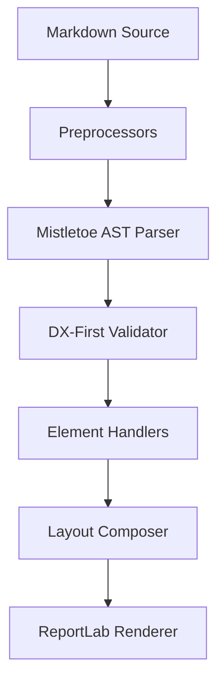

# A Unified Framework for Programmatic Document Generation

**Abstract:** *We present a lightweight, fast, and dependency-free method for compiling structured Markdown documents directly into print-ready PDF files. Unlike conventional approaches that rely on heavy web rendering engines (e.g., headless Chromium) or extensive CLI wrappers (e.g., Pandoc and LaTeX), our engine leverages a direct compiler pipeline from a Python-based Markdown Abstract Syntax Tree (AST) straight to ReportLab flowables. We explore performance characteristics, typesetting rules, and the integration of mathematical notation and vector diagrams.*

---

## 1. Introduction

Document processing systems traditionally fall into two categories:
1. **Interactive wysiwyg editors**, which are prone to styling inconsistencies and lack programmatic extensibility.
2. **Markup languages** like $\LaTeX$ or HTML/CSS, which require massive software distributions or depend on heavy browser engine runtimes.

We introduce a middle ground: **programmatic Markdown compilation**. By leveraging a parser to build a robust AST, we map structural tokens directly to programmatic layout elements (flowables).

## 2. Pipeline Architecture

The compiler operates in four distinct phases: pre-processing, parsing/validation, element mapping, and layout composition. The diagram below illustrates this linear data flow:

## 3. Mathematical Notation

Mathematical statements are parsed from standard $\LaTeX$ notation. Single dollar signs denote inline math such as $f(x) = \sin(x) \cdot e^{-x^2}$. Display or block math uses double dollar signs:

$$
\oint_C \mathbf{B} \cdot d\mathbf{l} = \mu_0 \left( I_{\text{enc}} + \varepsilon_0 \frac{d\Phi_E}{dt} \right)
$$

These equations are automatically pre-fetched in parallel and cached using SHA-256 hashes of their raw LaTeX strings to prevent redundant network round-trips[^1].

[^1]: Caching is performed in the local user cache directory (e.g., `~/.cache/pymd2pdf`) and supports offline fallbacks.

## 4. Empirical Evaluation

To measure the rendering speed, we compared our engine against a headless Chromium browser wrapper across documents of various sizes.

| Page Count | Headless Chrome (sec) | md2pdf (sec) | Speedup Ratio |
| :--------- | :-------------------: | -----------: | ------------- |
| 5 pages    |         2.45          |         0.18 | 13.61×        |
| 20 pages   |         3.12          |         0.45 | 6.93×         |
| 100 pages  |         7.84          |         1.89 | 4.15×         |

As shown in the table above, the compilation overhead of our engine is significantly lower, making it ideal for high-throughput automated report generation.

\pagebreak

## 5. Conclusions

By eliminating the browser-level dependency, programmatic document compilation achieves substantial performance gains while maintaining rigorous typesetting rules such as orphaned heading prevention and dynamic page-breaking logic[^2].

[^2]: Layout composer rules ensure that tables split cleanly across page boundaries and repeat headers on subsequent pages automatically.
