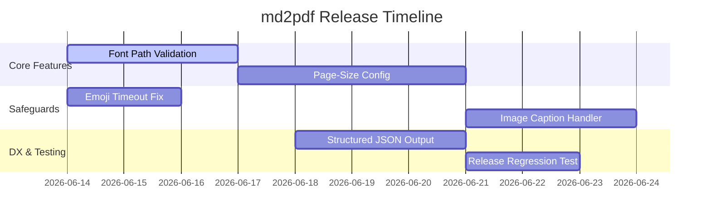

# md2pdf Engine - Version 0.5.0 Release Roadmap

This roadmap outlines the milestones, features, and fixes scheduled for the upcoming `v0.5.0` release of the programmatic markdown-to-pdf typesetting engine.


## Project Status Timeline

Below is the high-level roadmap showing the dependencies and sequence of tasks leading up to the `v0.5.0` release.



## 🗒️ Milestone Task List

### Core Rendering Pipeline & Config
- [x] Concurrent pre-fetching of Mermaid & LaTeX diagram assets via thread pool (completed in `v0.4.0`)
- [x] Table column alignment styling support via `:---` syntax (completed in `v0.4.0`)
- [/] **Feature**: Expose page sizing (e.g., A4, Letter, A3) and page orientation (landscape/portrait)
- [ ] **Feature**: Support user-defined image captions using Markdown image alt-text
- [ ] **Validator**: Implement pre-flight validation checks for custom TTF font files specified in `[theme]`

### Network & Reliability Safeguards
- [x] Offline fallback placeholder box renderer when Kroki API is unavailable (completed in `v0.3.0`)
- [ ] **Bugfix**: Add explicit timeout logic in `EmojiPreProcessor` download calls to prevent network hangs

### Developer Experience (DX)
- [ ] **CLI**: Add `--format json` output flag for `--validate-only` command to ease CI/CD automation integration


\pagebreak

## Detailed Design Briefs

### 1. Font Path Validation

Currently, if a user references a font file path in their `md2pdf.toml` theme section that is incorrect, the engine crashes deep in ReportLab during font registration. We are introducing a validation rule to verify paths early.

```python
import os
from md2pdf.core.errors import ConfigError

def validate_font_paths(theme_config) -> None:
    for field in ["font_file_body", "font_file_heading", "font_file_mono"]:
        path = getattr(theme_config, field, "")
        if path:
            expanded = os.path.expanduser(path)
            if not os.path.isfile(expanded):
                raise ConfigError(
                    f"Configuration error: Font file specified in '{field}' "
                    f"does not exist: {path}"
                )
```

:::tip "Pre-flight Validation"
Pre-flight check functions should be registered under the `Pipeline.validate()` sequence so that they return structured `ValidationIssue` collections rather than raising raw errors immediately.
:::

---

### 2. Page-Size & Orientation Configuration

To support custom document layouts (e.g., landscape slide presentations or legal briefs), we will expose the page geometry settings.

> [!WARNING]
> Changing the page size or orientation changes the printable width boundaries. Complex elements like tables and diagrams will scale to fit the new boundaries automatically, but manual page breaks (`\pagebreak`) may require review.

```toml
# Example md2pdf.toml with custom geometry
[md2pdf]
page_size = "letter"        # options: a4, letter, legal, a3, a5
page_orientation = "landscape" # options: portrait, landscape
```
