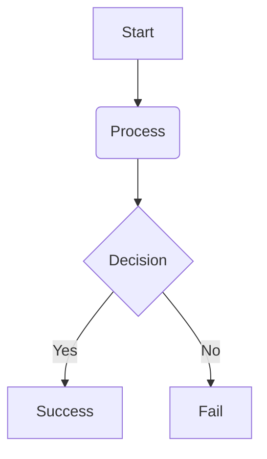

# Diagrams Document

## Mermaid Chart

```mermaid
graph TD
    A[Start] --> B(Process)
    B --> C{Decision}
    C -->|Yes| D[Success]
    C -->|No| E[Fail]
```

## LaTeX Block
```latex
\begin{align*}
    f(x) &= x^2 + 2x + 1 \\
         &= (x+1)^2
\end{align*}
```
